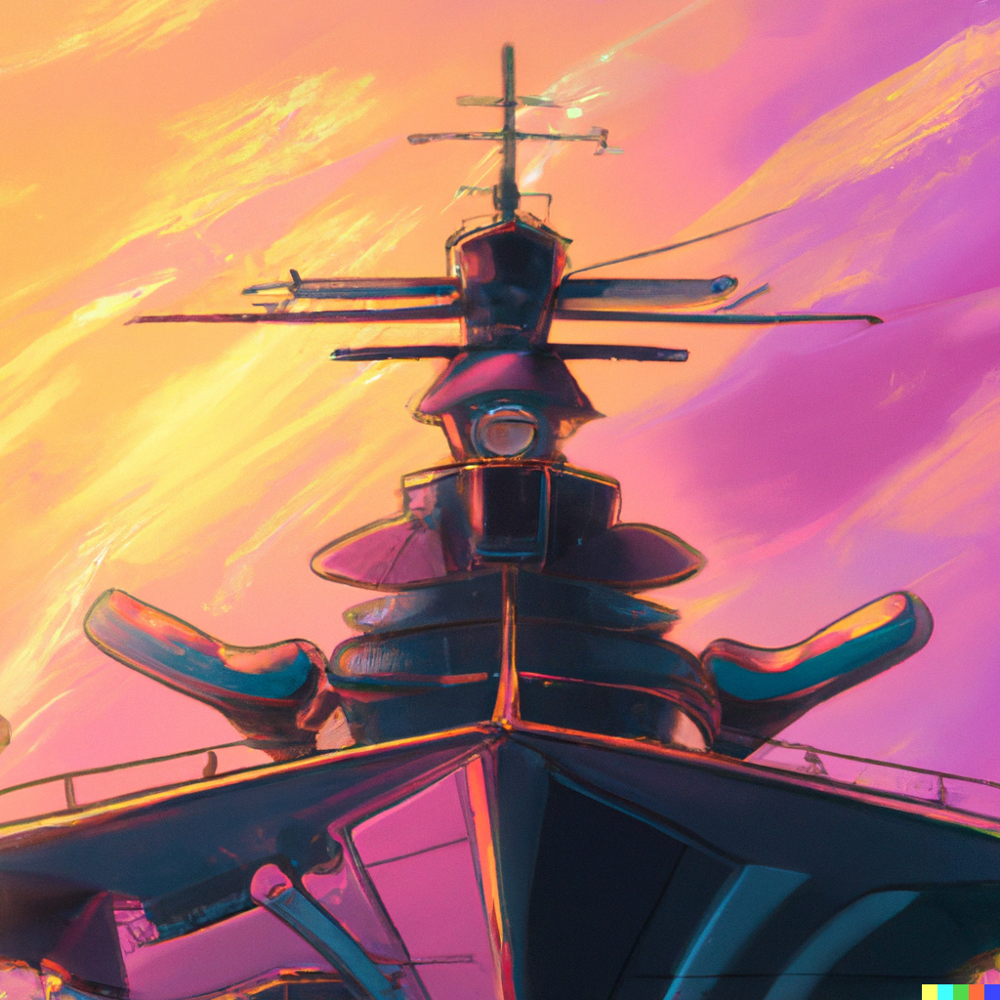

 
 
  <a href="https://ship.arandeep.com" target="_blank" rel="noopener noreferrer">Visit the site here!<a>
 

# Battleship Clone

> This webapp is a clone of the battleship clone game with realtime turns and chat rooms.
> 
> Create your own rooms or join other.

# Features

### Turn based game with live chat

A real time turn based battleship game that uses websockets for a responsive game experience. 
    
Chat with your opponent in real time in the private chats for each game room.

# Tech stack

This project uses the [t3-stack template](https://github.com/t3-oss/create-t3-app). This stack provides a quick way to get started with a fully typesafe webapp. 
 
For realtime updates and messages the [ws package](https://www.npmjs.com/package/ws) is used in a node server.

The app is styled with [TailwindCSS](https://tailwindcss.com/) for quick inline styling.

  

